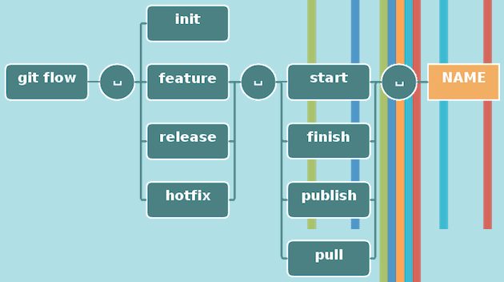

# Cheatsheet Git-Flow

Git-flow est un ensemble d'extensions git permettant des opérations complexe de manière simplifié sur un dépôt afin d'appliquer le modèle de branches de Vincent Driessen.

**_Cet aide-mémoire montre l'utilisation et les effets des opérations Git-flow_**

## Initialisation

_Git-flow doit être initialisé (comme git) afin de personnaliser la configuration de notre projet._

Afin de commencez à l'utiliser, il faut l'initialiser dans un dépôt git existant avec la commande suivante :

`git flow init`

Il faudra alors répondre à quelques questions concernant les conventions de nommage pour nos branches.

**_Il est recommandé d'utiliser les valeurs par défaut !_**

## Fonctionnalités (Features)

* Développe des nouvelles fonctionnalités pour notre prochaine version
* Existe généralement uniquement dans les dépôts des développeurs

### Commencer une fonctionnalité

_Le développement d'une fonctionnalité commence à partir de la branche 'develop'_

On la démarre donc avec la commande :

`git flow feature start MYFEATURE`

Cette commande crée une nouvelle branche de fonctionnalité basée sur `develop` et fait un switch automatique sur la nouvelle branche.

### Terminer une fonctionnalité

_Terminer le développement d'une fonctionnalité effectue les opérations suivantes :_

* Fusionne `MYFEATURE` dans `develop`
* Supprime la branche `MYFEATURE`
* Switch sur la branche `develop`

La commande est :

`git flow feature finish MYFEATURE`

### Publier une fonctionnalité

Si jamais vous développez une fonctionnalité en collaboration alors publiez la sur le serveur distant afin qu'elle puisse être utilisée par d'autres utilisaeurs grâce à la commande suivante :

`git flow feature publish MYFEATURE`

### Récupérer une fonctionnalité publiée

Afin de récupérer une fonctionnalité publiée par un autre utilisateur sur un serveur distant il faut faire :

`git flow feature pull origin MYFEATURE`

Mais nous pouvons aussi suivre une fonctionnalité sur le serveur distant en utilisant :

`git flow feature track MYFEATURE`

## Livraison (Release)

* Préparation de la sortie d'une nouvelle version de production
* Permet les corrections de bugs mineurs et la préparation des métadonnées de la release

### Commencer une livraison

Pour commencer une livraison, on créer une branche basée sur la branche de développement avec la commande :

`git flow release start RELEASE [BASE]`

**_Vous pouvez si besoin ajouter le paramètre `[BASE]`, il faut pour cela mettre le hash d'un commit à partir duquel commencera la livraison._**

**_Ce commit doit faire partie de la branche de développement._**

✴️ ✴️ ✴️ ✴️ ✴️

Il est préférable de publier la branche de livraison après l'avoir créée afin de permettre aux autres développeurs de commiter dessus.

De la même manière que pour les fonctionnalités, on tuilise la commande :

`git flow release publish RELEASE`

Et nous pouvons aussi suivre une livraison sur un serveur distant en utilisant :

`git flow release track RELEASE`

### Terminer une livraison

Finir une livraison est une étapes majeures de cette méthode.

Plusieurs actions sont alors réalisées :

* Fusionne la branche de livraison dans la branche `master`
* Etiquette la livraison par son nom
* Fusionne la livraison dans la branche `develop`
* Supprime la branche de livraison

La commande pour terminer notre livraison est :

`git flow release finish RELEASE`

:warning: **_N'oubliez pas de pousser vos étiquettes avec `git push --tags`_**

## Correctifs (Hotfix)

* Les correctifs sont utiles quand il est nécessaire de corriger immédiatement l'état incorrect de la version en production  
* Ils peuvent se baser sur l'étiquette de la branche `master` indiquant la version en prodution

### Commencer un hotfix

Comme pour les autres commandes, un hotfix est commencé de la manière suivante :

`git flow hotfix start VERSION [BASENAME]`

ici, le paramètre `VERSION` indique le nom de la future release corrigée.

Il est aussi possible, si besoin, de spécifier à quelle release s'appliquera le hotfix.

### Terminer un hotfix

En terminant un hotfix, il est fusionné dans les branches `develop` et `master`. De plus la fusion vers `master` est etiquetée par la version du hotfix.

On tape la commande suivante afin de terminer un hotfix :

`git flow hotfix finish VERSION`

## Rappel commandes

